# 🌐 Chrome Session Manager

<div align="center">


**A powerful, user-friendly bash script for macOS that allows you to backup, restore, and manage your Chrome browser sessions with ease.**

*Never lose your browsing session again!* ✨

</div>

---

## 📋 Table of Contents

- [✨ Features](#-features)
- [🚀 Quick Start](#-quick-start)
- [📋 Menu Guide](#-menu-guide)
- [🔧 Configuration](#-configuration)
- [⚠️ Limitations](#️-limitations--important-notes)
- [📁 Technical Details](#-technical-details)
- [🛠️ Troubleshooting](#️-troubleshooting)
- [💡 Usage Examples](#-usage-examples)
- [🤝 Contributing](#-contributing)

---

## ✨ Features

<table>
<tr>
<td width="50%">

### 💾 **Session Management**
- 🔄 **Complete Session Backup** - Windows, tabs, positions
- 📜 **Multiple Restore Options** - Latest or specific backups
- 🎯 **Precise Window Restoration** - Exact positions and states
- 📌 **Pinned Tab Support** - Maintains pinned status

</td>
<td width="50%">

### 🎨 **User Experience**
- 🌈 **Beautiful Terminal UI** - Colors and emojis throughout
- 🚀 **Intuitive Menus** - Simple numbered options
- ⚡ **Quick Actions** - Fast backup and restore workflow  
- 🔧 **Chrome Controls** - Show, hide, quit, launch

</td>
</tr>
<tr>
<td width="50%">

### 🗂️ **Backup Management**
- 📊 **Smart Organization** - Automatic timestamping
- 🧹 **Cleanup Tools** - Delete old or specific backups
- 📈 **Usage Statistics** - File sizes and ages
- 🎛️ **Flexible Storage** - Custom backup directories

</td>
<td width="50%">

### ⚙️ **Advanced Features**
- 🔍 **Dependency Checking** - Automatic validation
- 🛡️ **Error Handling** - Graceful failure recovery
- 📱 **Status Monitoring** - Real-time Chrome state
- 🎭 **Window State Management** - Minimized/maximized support

</td>
</tr>
</table>

---

## 🚀 Quick Start

### 📋 Prerequisites

> **System Requirements**

| Component | Requirement | Status |
|-----------|-------------|---------|
| **Operating System** | macOS | 🍎 Required |
| **Browser** | Google Chrome | 🌐 Required |
| **Runtime** | Python 3 | 🐍 Usually pre-installed |
| **Permissions** | Accessibility & Automation | 🔐 Setup required |

### 🔽 Installation

```bash
# 1️⃣ Download the script
cd ~/Downloads
curl -O https://raw.githubusercontent.com/tnkrueckergreen/chrome-session-manager/refs/heads/main/chrome_session_manager.sh

# 2️⃣ Make it executable  
chmod +x chrome-session-manager.sh

# 3️⃣ Run it!
./chrome-session-manager.sh
```

### 🎯 First Time Setup

The script will automatically:

- ✅ **Check dependencies** (Python 3, osascript)
- 📁 **Create backup directory** at `~/Documents/chrome-session-backups/`  
- 🎨 **Display the beautiful main menu**

> **💡 Pro Tip:** Grant Terminal accessibility permissions in System Preferences before running!

---

## 📋 Menu Guide

<details>
<summary><strong>🎯 Click to expand the complete menu breakdown</strong></summary>

### 1️⃣ 💾 Backup Current Session

<blockquote>
<strong>📸 What it captures:</strong>
<ul>
<li>🪟 All open Chrome windows</li>
<li>📑 Every tab with URL and title</li>
<li>📌 Pinned tab status</li>  
<li>📐 Window positions and sizes</li>
<li>🔽 Minimized window states</li>
</ul>

<strong>🎛️ Post-backup options:</strong>
<ul>
<li>🙈 Hide Chrome (keep running)</li>
<li>🛑 Quit Chrome completely</li>
<li>✨ Leave Chrome as-is</li>
</ul>
</blockquote>

### 2️⃣ 🔄 Restore Latest Backup

<blockquote>
<strong>⚡ Quick restoration of your most recent session</strong>
<ul>
<li>📅 Shows backup date and time</li>
<li>📦 Displays file size</li>
<li>🚀 One-click restore</li>
<li>➕ Creates new windows (doesn't close existing)</li>
</ul>
</blockquote>

### 3️⃣ 📜 Restore from a List  

<blockquote>
<strong>🎯 Browse and select from all available backups</strong>
<ul>
<li>📊 Sorted by date (newest first)</li>
<li>📏 File sizes displayed</li>
<li>🎨 Friendly date formatting</li>
<li>🔢 Simple numbered selection</li>
</ul>
</blockquote>

### 4️⃣ 🔧 Chrome Controls

<blockquote>
<strong>🎮 Full Chrome process management</strong>
<table>
<tr><td>🙈 <strong>Hide</strong></td><td>Keep running but invisible</td></tr>
<tr><td>👀 <strong>Show</strong></td><td>Bring to front and focus</td></tr>
<tr><td>🛑 <strong>Quit</strong></td><td>Complete shutdown</td></tr>
<tr><td>🚀 <strong>Launch</strong></td><td>Start Chrome if not running</td></tr>
</table>
</blockquote>

### 5️⃣ 🗂️ Manage Backups

<blockquote>
<strong>🧹 Complete backup lifecycle management</strong>

**📊 List All Backups**
- 📅 Creation dates and times
- 📦 File sizes  
- ⏳ Age in days
- 📈 Sorted chronologically

**🗑️ Smart Cleanup** 
- 🎯 Delete backups older than 30 days
- 📊 Shows count before deletion
- ⚠️ Confirmation required

**🚮 Selective Deletion**
- 🎯 Choose specific backups to remove
- 📋 Numbered list interface
- 🛡️ Double confirmation for safety

**📁 Directory Management**
- 🎛️ Change backup location (session-only)
- 🏠 Supports tilde expansion (`~`)
- ✅ Auto-creates directories
</blockquote>

### 6️⃣ 🚪 Exit

<blockquote>
<strong>👋 Clean shutdown with friendly goodbye</strong>
</blockquote>

</details>

---

## 🔧 Configuration

### 📁 Custom Backup Directory

<table>
<tr>
<th width="50%">🔄 Temporary (Current Session)</th>
<th width="50%">💾 Permanent</th>
</tr>
<tr>
<td>

Use **Menu Option 5 → 4**
```
🗂️  Manage Backups
 └── 📁 Change Backup Directory
```

</td>
<td>

Add to your shell profile:
```bash
# ~/.zshrc or ~/.bash_profile
export CHROME_SESSION_BACKUP_DIR="/your/custom/path"
```

Then reload:
```bash
source ~/.zshrc
```

</td>
</tr>
</table>

### 🎨 Environment Variables

| Variable | Purpose | Default | Example |
|----------|---------|---------|---------|
| `CHROME_SESSION_BACKUP_DIR` | Backup location | `~/Documents/chrome-session-backups` | `/Users/john/MyBackups` |

---

## ⚠️ Limitations & Important Notes

<div align="center">
<strong>⚠️ CRITICAL: Single Profile Operation</strong>
</div>

### 🔍 How Chrome Profiles Work

```mermaid
graph LR
    A[Chrome Profile 1<br/>🏢 Work] --> C[Chrome Process]
    B[Chrome Profile 2<br/>🏠 Personal] --> C
    C --> D[🖥️ Multiple Windows]
```



### 📸 What Happens During Backup

> **The script captures ALL Chrome windows currently open, regardless of profile**

| Scenario | What Gets Backed Up |
|----------|-------------------|
| 🏢 Only Work profile open | ✅ Only work tabs |
| 🏠 Only Personal profile open | ✅ Only personal tabs |  
| 🏢🏠 Both profiles open | ⚠️ **ALL tabs from BOTH profiles** |

### 🔄 What Happens During Restore

> **All restored tabs open in whatever profile Chrome chooses (usually default)**

```
📁 Backup File Contains:
├── 🏢 Work tabs (Gmail, Slack, etc.)
└── 🏠 Personal tabs (YouTube, Facebook, etc.)

🔄 After Restore:
└── 🏢 Work Profile
    ├── 📧 Gmail ✅
    ├── 💬 Slack ✅  
    ├── 📺 YouTube ⚠️ (Wrong profile!)
    └── 👥 Facebook ⚠️ (Wrong profile!)
```

### 💡 Best Practices for Multi-Profile Users

<details>
<summary><strong>🎯 Click for detailed workflow recommendations</strong></summary>

#### ✅ **Recommended Workflow**

1. **Before Backup:**
   ```bash
   # Close all Chrome windows except the profile you want to backup
   # Example: Keep only Work profile windows open
   ```

2. **Create Profile-Specific Backups:**
   ```bash
   # Backup Work profile
   ./chrome-session-manager.sh → Option 1
   
   # Close Work windows, open Personal windows
   # Backup Personal profile  
   ./chrome-session-manager.sh → Option 1
   ```

3. **Use Descriptive Names:**
   ```bash
   # Rename backup files for clarity
   mv chrome-session-2024-01-15T09-30-00.json work-session-morning.json
   mv chrome-session-2024-01-15T17-30-00.json personal-session-evening.json
   ```

#### ⚠️ **What to Avoid**

- ❌ **Don't backup with multiple profiles open** (causes mixing)
- ❌ **Don't assume restored tabs go to the "right" profile**
- ❌ **Don't rely on the script for profile separation**

</details>

---

## 📁 Technical Details

### 🏗️ Backup File Structure

<details>
<summary><strong>📊 JSON Schema & Examples</strong></summary>

#### 📝 File Naming Convention
```
chrome-session-YYYY-MM-DDTHH-MM-SS.json
```

#### 🗂️ JSON Structure
```json
{
  "createdAt": "2024-01-15T09:30:00.000Z",
  "windows": [
    {
      "index": 1,
      "minimized": false,
      "bounds": [100, 100, 1200, 800],
      "tabs": [
        {
          "url": "https://github.com",
          "title": "GitHub",
          "pinned": false
        },
        {
          "url": "https://gmail.com", 
          "title": "Gmail",
          "pinned": true
        }
      ]
    }
  ]
}
```

#### 📐 Bounds Format
```
[x, y, width, height]
├── x: Distance from left edge
├── y: Distance from top edge  
├── width: Window width in pixels
└── height: Window height in pixels
```

</details>

### 🔧 Dependencies & Technologies

| Component | Purpose | Implementation |
|-----------|---------|----------------|
| **AppleScript/JXA** | Chrome automation | Native macOS scripting |
| **Python 3** | JSON processing | Built-in json module |
| **Bash** | Main script logic | POSIX-compliant shell |
| **osascript** | AppleScript execution | macOS system utility |

---

## 🛠️ Troubleshooting

<details>
<summary><strong>🚨 Common Issues & Solutions</strong></summary>

### 🔐 Permission Issues

<blockquote>
<strong>❌ Error:</strong> "AppleScript permission denied"

<strong>✅ Solution:</strong>
<ol>
<li>🍎 <strong>System Preferences</strong> → <strong>Security & Privacy</strong> → <strong>Privacy</strong></li>
<li>🔓 Click the lock icon and enter your password</li>
<li>♿ Select <strong>Accessibility</strong> from left panel</li>
<li>➕ Add <strong>Terminal</strong> (or your terminal app)</li>
<li>✅ Enable the checkbox next to it</li>
<li>🤖 Select <strong>Automation</strong> from left panel</li>
<li>➕ Find <strong>Terminal</strong> and enable <strong>Google Chrome</strong></li>
</ol>
</blockquote>

### 🚫 Script Won't Execute

<blockquote>
<strong>❌ Error:</strong> "Permission denied"

```bash
# ✅ Make script executable
chmod +x chrome-session-manager.sh

# ✅ Verify executable status
ls -la chrome-session-manager.sh
# Should show: -rwxr-xr-x
```
</blockquote>

### 🔍 Missing Dependencies

<blockquote>
<strong>❌ Error:</strong> "'python3' not found"

```bash
# ✅ Check if Python 3 is installed
which python3
python3 --version

# ✅ Install if missing (using Homebrew)
brew install python
```

<strong>❌ Error:</strong> "'osascript' not found"

```bash
# ✅ osascript should be built into macOS
which osascript

# If missing, you're likely not on macOS
uname -s  # Should return "Darwin"
```
</blockquote>

### 📁 Backup Directory Problems

<blockquote>
<strong>❌ Error:</strong> "Cannot create backup directory"

```bash
# ✅ Check current backup location
echo $CHROME_SESSION_BACKUP_DIR

# ✅ Manually create directory
mkdir -p ~/Documents/chrome-session-backups

# ✅ Check permissions
ls -la ~/Documents/
```
</blockquote>

### 🌐 Chrome Won't Respond

<blockquote>
<strong>❌ Error:</strong> Chrome doesn't launch or respond to commands

```bash
# ✅ Test basic AppleScript communication
osascript -e 'tell application "Google Chrome" to activate'

# ✅ Force quit and restart Chrome
pkill -f "Google Chrome"
open -a "Google Chrome"

# ✅ Check Chrome installation
ls -la /Applications/Google\ Chrome.app
```
</blockquote>

### 🔧 Advanced Debugging

```bash
# Enable verbose output for troubleshooting
set -x  # Add this to top of script for debug mode

# Test JSON parsing separately
echo '{"test": "value"}' | python3 -m json.tool

# Verify AppleScript permissions manually
osascript -e 'tell application "System Events" to get name of every process'
```

</details>

---

## 💡 Usage Examples

<details>
<summary><strong>🎯 Real-World Workflows & Scenarios</strong></summary>

### 📅 **Daily Workflow Management**

#### 🌅 Morning Routine
```bash
# 1. Start with clean slate
./chrome-session-manager.sh
├── Option 4 (Chrome Controls)
└── Option 3 (Quit Chrome)

# 2. Restore yesterday's work session
./chrome-session-manager.sh  
├── Option 3 (Restore from List)
└── Select: work-session-2024-01-14.json
```

#### 🌅 → 🌆 Workflow Transition  
```bash
# End of work day
./chrome-session-manager.sh
├── Option 1 (Backup Current Session)
└── Option 2 (Quit Chrome) 

# Switch to personal browsing
./chrome-session-manager.sh
├── Option 3 (Restore from List)  
└── Select: personal-session-evening.json
```

### 🔄 **Project-Based Sessions**

#### 📊 Research Project
```bash
# Backup current research tabs
./chrome-session-manager.sh → Option 1
# Rename: research-ai-trends-2024.json

# Later: restore research context
./chrome-session-manager.sh → Option 3  
└── Select research backup
```

#### 💻 Development Work
```bash
# Save development environment
├── GitHub repos (3 tabs)
├── Documentation (5 tabs)  
├── Stack Overflow (2 tabs)
└── Local development servers (2 tabs)

# Quick restore for code reviews
./chrome-session-manager.sh → Option 2 (Latest)
```

### 🛡️ **Emergency Recovery**

#### 💥 Chrome Crash Recovery
```bash
# Chrome crashed with 20+ important tabs
./chrome-session-manager.sh
├── Option 2 (Restore Latest)
└── ✅ All tabs restored in seconds!
```

#### 🔄 System Reboot
```bash
# Before planned restart:
./chrome-session-manager.sh → Option 1 (Backup)

# After reboot:
./chrome-session-manager.sh → Option 2 (Restore Latest)
```

### 📊 **Session Organization**

#### 🗂️ Weekly Backup Cleanup
```bash
./chrome-session-manager.sh
├── Option 5 (Manage Backups)
├── Option 1 (List all backups)
└── Review and clean old sessions
```

#### 📈 **Backup Statistics**
```
📊 Backup Analysis:
├── 📅 This Week: 12 backups
├── 📦 Average Size: 15KB  
├── 🏆 Largest Session: 47 tabs
└── 🧹 Cleanup Suggestion: 8 old backups
```

</details>

---

## 🤝 Contributing

<div align="center">

[](CONTRIBUTING.md)
[](../../issues)
[](../../pulls)

</div>

### 🎯 Ways to Contribute

<table>
<tr>
<td width="25%">

#### 🐛 **Report Bugs**
- Use issue templates
- Provide system info
- Include error messages
- Share reproduction steps

</td>
<td width="25%">

#### ✨ **Suggest Features**
- Multi-profile support
- GUI interface
- Cloud backup sync
- Chrome extension

</td>
<td width="25%">

#### 💻 **Code Contributions**
- Bug fixes
- Performance improvements
- New features
- Documentation updates

</td>
<td width="25%">

#### 📖 **Documentation**
- Tutorial videos
- Use case examples
- Translation
- FAQ expansion

</td>
</tr>
</table>

### 🔄 Development Workflow

```bash
# 1️⃣ Fork & Clone
git clone https://github.com/tnkrueckergreen/chrome-session-manager.git

# 2️⃣ Create Feature Branch  
git checkout -b feature/amazing-new-feature

# 3️⃣ Make Changes & Test
./chrome-session-manager.sh  # Test thoroughly

# 4️⃣ Commit & Push
git commit -m "✨ Add amazing new feature"
git push origin feature/amazing-new-feature

# 5️⃣ Create Pull Request
```

---

## 📄 License & Legal

<div align="center">

[](LICENSE)

**This project is open source and available under the [MIT License](LICENSE)**

</div>

### 🛡️ Disclaimer

> **⚠️ Important:** This script modifies Chrome browser state and requires system permissions. Use responsibly:
> 
> - ✅ **Test first** with non-critical browsing sessions
> - 🔒 **Keep important bookmarks** separately backed up  
> - 📱 **Grant only necessary permissions** (Accessibility, Automation)
> - 🚫 **Not responsible** for data loss or browser issues

---

## 🆘 Support & Community

<div align="center">

### 💬 Get Help

[](../../issues)
[](https://stackoverflow.com/questions/tagged/chrome-session-manager)

### 🚀 Quick Support Checklist

</div>

<details>
<summary><strong>🔧 Before Asking for Help</strong></summary>

#### ✅ **Verify Prerequisites**
- [ ] Running on macOS
- [ ] Google Chrome installed  
- [ ] Python 3 available (`python3 --version`)
- [ ] Terminal has required permissions

#### ✅ **Try Basic Troubleshooting**
- [ ] Restart Chrome completely
- [ ] Run script with clean Chrome state
- [ ] Check backup directory permissions
- [ ] Test with simple AppleScript: `osascript -e 'tell application "Google Chrome" to activate'`

#### ✅ **Gather Information**
- [ ] macOS version (`sw_vers`)
- [ ] Chrome version (Chrome → About Google Chrome)
- [ ] Python version (`python3 --version`)
- [ ] Full error message (copy/paste)
- [ ] Steps to reproduce

</details>

---

<div align="center">

### 🌟 **Star this repository if it saved your browsing session!** ⭐

**Happy browsing!** 🌐✨

---

*Made with ❤️ for the Chrome power users who refuse to lose their tabs*

</div>
